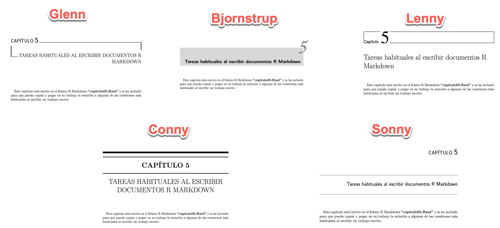

# Sobre la plantilla para crear un Trabajo Fin de Estudios: MemoriaTFE

Repositorio que mantiene actualizado el proyecto MemoriaTFE que se encuentra publicado a través de mi página web: 
<http://destio.us.es/calvo/Qseries_tutorialesSobrePlantillaTFE.html> y en <http://destio.us.es/calvo/Qpost/2017-11-26_escribir-un-trabajo-fin-de-estudios-con-rmarkdown/index.html>.


- [Los sistemas de bibliografía](#los-sistemas-de-bibliografía)
- [Simplificar cabeceras de ficheros de capítulos](#simplificar-cabeceras-de-ficheros-de-capítulos)
- [Uso de diferentes familias de fuentes](#uso-de-diferentes-familias-de-fuentes)
- [Crear un documento sin capítulos](#crear-un-documento-sin-capítulos)
- [Otros ajustes](#otros-ajustes)
- [Referencias](#referencias)

# Algunos consejos

## Los sistemas de bibliografía

### Método 1: El sistema de bibiografía basado en natbib


El uso del paquete LaTeX "natbib" para trabajar con la bibliografía, se activa en la cabecera "yaml" del fichero "tfe_principal.Rmd" del siguiente modo:

```yaml
bibliography: ["bib/library.bib", "bib/paquetes.bib"]
metodobib: true
biblio-style: "apa-good"

output: 
  pdf_document:
    citation_package: natbib  
```

Se pueden hacer uso de las siguientes opciones adicionales:

```yaml
bibliography: ["bib/library.bib", "bib/paquetes.bib"]
#biblio-title: "Referencias"
# metodobib -> true: natbib (descomentar: citation_package: natbib) 
#           -> false: pandoc (comentar: citation_package: natbib)
metodobib: true
#biblio-style con natbib
#natbib: plainnat, abbrvnat, unsrtnat
#natbib: chicago, apalike
#natbib: apalike2 (https://ctan.org/pkg/apalike2)
biblio-style: "apa-good"
#natbiboptions: "numbers" # "square,numbers" # ver: https://www.ctan.org/pkg/natbib
# más info: authoryear,numbers,  super, angle, sort, compress
# https://ctan.javinator9889.com/macros/latex/contrib/natbib/natnotes.pdf

```


Los estilos de bibliografía con "natbib" que se ha comprobado funcionan con esta plantilla al seleccionarlos con el parámetro "biblio-style" son:

- plainnat, abbrvnat, unsrtnat
- chicago, apalike
- apalike2 (<https://ctan.org/pkg/apalike2>)
- ACM-Reference-Format ([ref-url](https://www.bibtex.com/s/bibliography-style-acmart-acm-reference-format/))

Los siguientes estilos no pueden usarse con el paquete "natbib" cargado y por tanto no serían válidos los comandos de citación específicos de "natbib" (solución no recomendada para que funcionase, sería comentar la orden `\usepackage{natbib}` en el fichero "tfe_principal.tex" y compilar con "pdflatex"):

- plain, alpha, abbrv, unsrt, acm, ieeetr


```
biblio-style: plainnat
```

### Método 2: el sistema de bibliografía basado en pandoc-csl


```yaml
bibliography: ["bib/library.bib", "bib/paquetes.bib"]
metodobib: false
csl: methods-in-ecology-and-evolution.csl      # no numera mejor en las citas
#csl: acm-sig-proceedings-long-author-list.csl  # numera peor en las citas
#csl: apa.csl  # apa.csl, ieee.csl

output: 
  pdf_document:
    #citation_package: natbib  
```


### Método 3: el sistema de bibliografía basado en flexbib


La información sobre el paquete LaTeX "flexbib" sobre BibTeX se encuentra en: <https://www.latex.um.es/retazos/leccion_15/flexbib.html>. Desde aquí quiero hacer constar el agradecimiento a los creadores.

Con el paquete LaTeX "flexbib" se facilita la escritura de la **bibliografía en español** (también se puede usar para otros idiomas a través del paquete LaTeX "babel").

- [Manual flexbib (pdf)](https://www.latex.um.es/retazos/leccion_15/flexbib-Manual-v2.pdf)

    En el manual se pueden encontrar todas las opciones disponibles a partir de la página 5. 


#### Cómo usar flexbib en la plantilla

**Importante.** En la cabecera yaml se debe tener activo los siguientes valores:

```yaml
metodobib: true

output: 
  pdf_document:
    citation_package: natbib
```

Si se va a usar "flexbib" se deben ajustar también los valores de: `flexbib` y `flexbiboptions`, en la cabecera "yaml" del fichero "tfe_principall.Rmd".

Se muestran algunos ejemplos a continuación:

- Ejemplo 1. Se eligen: plain (bibliografía numerada)

    ```yaml
    flexbib: true
    flexbiboptions: plain
    ```

- Ejemplo 2. Se elige: por defecto se utiliza referencias autor-año (bibliografía sin numerar)

    ```yaml
    flexbib: true
    ```


- Ejemplo 3. Se elige: apa7 (usa metodología apa sin numerar la bibliografía)

    ```yaml
    flexbib: true
    flexbiboptions: apa7
    ```

#### Solución de problemas

1. Si se cambia de método bibliográfico, se recomienda borrar previamente los ficheros con extensión: ".bbl" y ".blg", si no se hace podría producirse errores lo que impediría la creación del fichero pdf final.


## Simplificar cabeceras de ficheros de capítulos

La idea se pudo concretar usando la información en: [Stackoverflow: "Importing common YAML in rstudio/knitr document"](https://stackoverflow.com/questions/39885363/importing-common-yaml-in-rstudio-knitr-document).


Se han creado unos ficheros cuyos nombres empiezan por "cabecera_*.*" que contienen información en formato: "yaml", "tex" (latex) y "R", de forma que los ficheros R Markdown (Rmd) que contienen la información de los distintos capítulos y apéndices tienen menos definiciones al inicio de cada uno de estos ficheros lo que tienen las siguientes ventajas:

1. Se accede rápidamente al texto-contenido del capítulo/apéndice.
2. Permite usar el "Editor Visual de RStudio" sin que se causen errores (ver nota a continuación). Se recomienda el uso de este editor visual de RStudio, sobre todo si se usa desde un primer momento.

**Nota:** Se recomienda no modificar esas primeras líneas.


**Nota:** No se recomienda utilizar el editor visual de RStudio (15-11-2021) con el fichero "capitulo05.Rmd", ya que modifica algunos códigos lo que produce una gran cantidad de errores. Por lo que cuando en un fichero Rmd se utilicen cuestiones avanzadas de LaTeX actualmente se recomienda no usar el editor visual de RStudio (futuras mejoras de esta buena herramienta podrían corregir este comportamiento).


## Uso de diferentes familias de fuentes

En la cabecera "yaml" del fichero "tfe_principal.Rmd" se puede usar (por defecto: "fontfamily: lmodern"):


- Familia "lmodern" pero con "sans serif" (paloseco)

    ```yaml
    paloseco: true
    ```

Nota: también se podría usar esta opción con otras fuentes, por ejemplo: "inconsolata".

- Familia: "helvet", y familia matemática: "mathptmx"

    ```yaml
    fontfamily: helvet
    fontmathfamily: mathptmx
    ```

    ```yaml
    fontfamily: helvet
    fontfamilyoptions: scaled
    fontmathfamily: mathptmx
    ```


- Familia: "avant", y familia matemática: "mathptmx"

    ```yaml
    fontfamily: avant
    fontmathfamily: mathptmx
    ```

- Familia: "roboto", y familia matemática: "mathptmx"

    ```yaml
    fontfamily: roboto
    fontfamilyoptions: sfdefault   #\usepackage[sfdefault]{roboto}
    fontmathfamily: mathptmx
    ```

- Familia: "arev"

    ```yaml
    fontfamily: arev
    ```

- Familia: "inconsolata"

    ```yaml
    fontfamily: inconsolata
    ```


- Familia: "FiraSans", y familia matemática: "newtxsf"

    ```yaml
    #paloseco: true # con fuente por defecto (lmodern)
    fontfamily: FiraSans
    fontfamilyoptions: "sfdefault,scaled=.85"
    negritastt: "0.85"
    fontmathfamily: newtxsf
    fontmathfamilyoptions: cmintegrals
    ```

- Nota: la opción `negritastt: "0.85"` añade el manejo de las fuentes typewriter en negrita y además 
mejora el uso de las fuentes typewriter (o verbatim).

Se puede encontrar más información en: [Github del libro: "LaTeX-Beginner"](https://github.com/PacktPublishing/LaTeX-Beginner-s-Guide-Second-Edition/tree/main/Chapter_10_-_Using_Fonts).

Algunos comandos LaTeX que permiten seleccionar fuentes diferentes con "pdflatex".

```
\renewcommand{\familydefault}{sfdefault}
usepackage{inconsolata} %buena
\usepackage{courier}

\usepackage{helvet}
\usepackage{sfmath}

\usepackage[math]{kurier}

%\usepackage{kmath}
\usepackage{kerkis}

\usepackage{concrete}
\usepackage{concmath}

\usepackage{newcent}
\usepackage{fouriernc}

\usepackage{newtxtext} % times
\usepackage{newpxmath}

\usepackage{newpxtext} % palatino
\usepackage{newpxmath}

\usepackage[light]{kpfonts}
\usepackage{cmbright}
\usepackage{arev}

\usepackage[sfdefault,scaled=.85]{FiraSans}
\usepackage[cmintegrals]{newtxsf}

% https://tex.stackexchange.com/questions/215482/how-do-i-get-texttt-with-bold-face-in-latex
\usepackage[sfdefault,scaled=0.95]{FiraSans}
\usepackage{bold-extra}
\usepackage[scaled=0.95]{beramono}
\usepackage[cmintegrals]{newtxsf}

\let\openbox\relax
\let\Bbox\relax
\usepackage{amssymb,amsmath}
%\usepackage[varqu,varl]{zi4}% inconsolata typewriter

```


Otras pruebas:

- Familia: "sourcecodepro"

    ```yaml
    fontfamily: sourcecodepro
    fontfamilyoptions: default   #\usepackage[default]{sourcecodepro}
    ```

## Crear un documento sin capítulos

Cambiar la cabecera yaml del siguiente modo:

```yaml
documentclass: article
article: true
```

En el fichero "tfe_principal.Rmd", eliminar los saltos de página no adecuados, quitar la lista de tablas y/o figuras si fuera necesario, etc.


## Otros ajustes


### Evitar que el código R fuente no sobrepase el ancho del texto

Se debe usar el siguiente parámetro en la cabecera yaml:

```yaml
codigoajusta: true
```

### Cambia el tamaño de la fuente del código en todo el fichero (echo)

Se debe usar el siguiente parámetro en la cabecera yaml ("normalsize", "small", "footnotesize"):

```yaml
codigofuente: "footnotesize"
```

### Cambia el tamaño de la fuente de la salida del código R en una parte del documento


Se debe usar de la siguiente manera en el texto ("normalsize", "small", "footnotesize", "tiny"):

````rmarkdown

\verbatimfont{\tiny}

```{r}
summary(mtcars)
```

\verbatimfont{\normalsize}

````


### Cambia el tamaño de la fuente del código R (echo) en una parte del documento


Se debe usar de la siguiente manera en el texto ("normalsize", "small", "footnotesize", "tiny"):

````rmarkdown

\renewcommand{\CodigoFuente}{\tiny}

```{r}
# une con segmentos lineales
plot(v_y ~ v_x, type="l",col="blue")  
```

```{r}
# une con segmentos lineales y puntos
plot(v_y~v_x,type="o",col="red")  
```

\renewcommand{\CodigoFuente}{\footnotesize}

````

### Cambiar el color del texto en teoremas

Introducir después del primer chunk del fichero "tfe_principal.Rmd" el siguiente comando LaTeX (se cambia a color negro en el modo pdf digital):

```tex
\definecolor{ocre}{RGB}{0,0,0}
```


### En lugar de "Apéndice" llamarlo "Anexo"

Modificar en el fichero "tfe_principal.Rmd" las líneas que aparecen junto a la instrucción LaTeX `\appendix`:

```
\renewcommand\appendixname{Anexo}
```

Se podría personalizar también la numeración de los apéndices añadiendo: 

```
\renewcommand\thechapter{\Alph{chapter}}                
\renewcommand\thesection{\Alph{chapter}.\Roman{section}} 
\setcounter{chapter}{0}
```

### Personalizar la presentación de los capítulos

Colocando en la cabecera yaml del fichero "tfe_principal.Rmd" las líneas asociadas a la clave: "header-includes" siguiente:
```yaml
link-citations: yes
header-includes:
  - \usepackage[Conny]{fncychap}
  - "% Options: Glenn, Sonny, Bjornstrup, Lenny, Conny, Reijne (estandar), Bjarne (no)"
output: 
```

Se usa el paquete LaTeX "fncychap" que dispone de varios formatos o estilos para la presentación de los capítulos.




### Cómo evitar errores de codificación con los ficheros de la plantilla-memoria

El motivo es que algunos alumnos envían problemas indicando que no se les crea el pdf y suele estar motivado porque han introducido algunos acentos y no están escritos en la codificación utf8. 

Los mensajes de error eran del siguiente tipo:

```
/Applications/RStudio.app/Contents/MacOS/quarto/bin/tools/pandoc +RTS -K512m -RTS tfe_principal.knit.md --to latex --from markdown+autolink_bare_uris+tex_math_single_backslash --output tfe_principal.tex --lua-filter /Library/Frameworks/R.framework/Versions/4.1/Resources/library/rmarkdown/rmarkdown/lua/pagebreak.lua --lua-filter /Library/Frameworks/R.framework/Versions/4.1/Resources/library/rmarkdown/rmarkdown/lua/latex-div.lua --self-contained --template latex/templateMemoriaTFE.tex --number-sections --highlight-style tango --pdf-engine pdflatex --natbib --include-before-body portadas/latex_paginatitulo_modTFE.tex 

processing file: ./capitulo05.Rmd
output file: tfe_principal.knit.md

pandoc: Cannot decode byte '\xe1': Data.Text.Internal.Encoding.decodeUtf8: Invalid UTF-8 stream
Error: pandoc document conversion failed with error 1
In addition: Warning messages:
1: package 'readxl' was built under R version 4.1.2 
2: package 'ggplot2' was built under R version 4.1.2 
3: package 'nlme' was built under R version 4.1.2 
4: In pt(-abs(tVal), fDF) : NaNs produced
Execution halted

```

Se puede resolver ejecutando en la consola de RStudio el siguiente código (asegurarse de que el fichero "funciones_detectar_problemasCodificacion.R" está en la misma carpeta que esté el fichero "tfe_principal.Rmd"):

```r
source("funciones_detectar_problemasCodificacion.R")
vficheros01 = c("portadas/latex_paginatitulo_modTFE.tex",
                "bib/library.bib","bib/paquetes.bib",
                "prologo.Rmd","resumen.Rmd","abstract.Rmd",
                "capitulo01.Rmd","capitulo02.Rmd", "capitulo03.Rmd",
                "capitulo04.Rmd","capitulo05.Rmd")
# func_utf8_corregir_problemas_ficheros(vficheros01, sobreescribir = FALSE)
func_utf8_corregir_problemas_ficheros(vficheros01, sobreescribir = TRUE)
```


# Referencias

## Ficheros pdf resultado de diferentes variantes de la plantilla

- Ficheros pdf modelos:

    + [Modelo para imprimir a doble cara y en blanco y negro (fuente: lmodern)](https://raw.githack.com/calote/MemoriaTFE/master/tfe_principal_imprimir2caras.pdf)

    + [Modelo en su versión de libro digital (fuente: lmodern, enlaces resaltados en color, no saltos de páginas extras, etc)](https://raw.githack.com/calote/MemoriaTFE/master/tfe_principal_librodigital.pdf)


    + [Uso de plantilla sin capítulos, mostrando solamente el capítulo 5: "Utiliddes para documentos R Markdown
(con la plantilla TFE)". Opciones: portada especial, versión digital, etc](https://raw.githack.com/calote/MemoriaTFE/master/tests/article02_noformatolibro_solocap05/tfe_principal_solocap05.pdf)

- Fichero pdf con el código R Markdown de los principales ficheros de la plantilla TFE:

    + [código R Markdown de los principales ficheros de la plantilla TFE](https://raw.githack.com/calote/MemoriaTFE/master/tests/FicherosRmdNumerados.pdf)


- Uso de fuentes:

    + [lmodern con paloseco (sans serif)](https://raw.githack.com/calote/MemoriaTFE/master/tests/fuentes01_lmodern_sansserif_paloseco/tfe_principal.pdf)

    + [helvet y mathptmx](https://raw.githack.com/calote/MemoriaTFE/master/tests/fuentes02_helvet_mathptmx/tfe_principal.pdf)

    + [Inconsolata y mathptmx](https://raw.githack.com/calote/MemoriaTFE/master/tests/fuentes03_inconsolata_mathptmx/tfe_principal.pdf)

    + [fireSans y newtxsf (manejo de negritas tipewriter)](https://raw.githack.com/calote/MemoriaTFE/master/tests/fuentes04_fireSans_newtxsf_negritastt/tfe_principal.pdf)


- Ajustando el código:

    + [Uso de codigoajusta (ver página 38)](https://raw.githack.com/calote/MemoriaTFE/master/tests/otros01_codigoajusta_pag38/tfe_principal.pdf): si el código sobre pasa el ancho del texto del documento lo arregla automáticamente.

    + [Uso de codigofuente sobre echo y CodigoFuente (ver página 29)](https://raw.githack.com/calote/MemoriaTFE/master/tests/otros03_codigofuente_echo_y_CodigoFuente_parcial/tfe_principal.pdf)
    
    
- Usando los sistemas de bibliografía:

    + [Método 1: natbib y estilo apa-good (numerado)](https://raw.githack.com/calote/MemoriaTFE/master/tests/bibmet01_natbib_apa-good_numbers/tfe_principal.pdf)

    + [Método 2: csl y estilo ecology ...](https://raw.githack.com/calote/MemoriaTFE/master/tests/bibmet02_csl_ecology/tfe_principal.pdf)

    + [Método 3: flexbib (spanish) y estilo plain (numerado) con año detrás del autor](https://raw.githack.com/calote/MemoriaTFE/master/tests/bibmet03_flexbib_plainspanishdatebegin/tfe_principal.pdf)


## Sobre Pandoc


- Pandoc oficial:
    + Manual (en html): <https://pandoc.org/MANUAL.html>
    + Templates pandoc en Github: <https://github.com/jgm/pandoc-templates>
        - [Template: default.latex](https://github.com/jgm/pandoc-templates/blob/master/default.latex)

- Otros sitios:

    + <https://github.com/Wandmalfarbe/pandoc-latex-template>

## Sobre fuentes


- Tutorial básico sobre fuentes en "overleaf": <https://es.overleaf.com/learn/latex/Font_typefaces>

## Información sobre LaTeX

- [ChuLaTeX: una chuleta muy chula (Jesús Salido)](http://visilab.etsii.uclm.es/wp-content/uploads/2020/06/chulatex.pdf)
