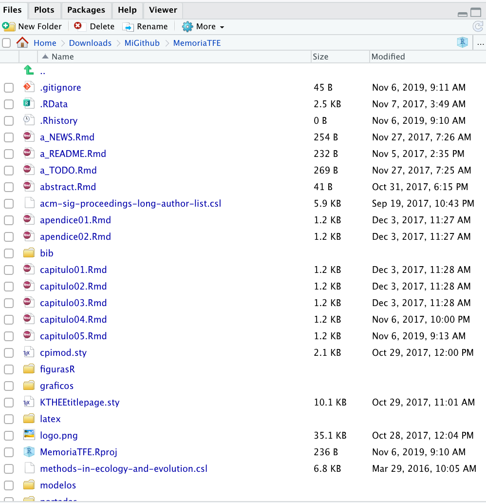
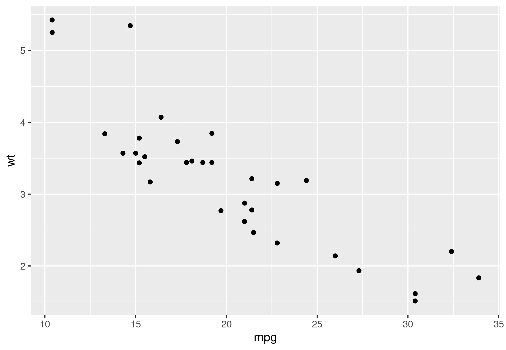

```{r include=FALSE}
#Sys.setlocale('LC_ALL','C') # corrige problema con 
options(kableExtra.latex.load_packages = F)
#options(tinytex.latexmk.emulation = FALSE)
knitr::opts_chunk$set(fig.path = 'figurasR/',
                      echo = FALSE, warning = FALSE, message = FALSE,
                      fig.pos="H",fig.align="center",out.width="95%",
                      cache=FALSE)
knitr::write_bib(c("knitr","rmarkdown","dplyr","ggplot2","kableExtra"),
                 file="bib/paquetes.bib", width = 60)
```


<!-- \setcounter{chapter}{2} -->
<!-- \setcounter{chapter}{2} escribir 2 para capítulo 3  -->
<!-- \pagenumbering{arabic} -->


\ifdefined\ifprincipal
\else
\setlength{\parindent}{1em}
\pagestyle{fancy}
\setcounter{tocdepth}{4}
\tableofcontents
<!-- \subpdfbookmark{Índice General}{indice} -->
\nocite{Luque2017,Luque2019,RStudio,R-base,
R-knitr,R-rmarkdown,R-dplyr,R-ggplot2,Techopedia}

\fi

\ifdefined\ifdoblecara
\fancyhead{}{}
\fancyhead[LE,RO]{\scriptsize\rightmark}
\fancyfoot[LO,RE]{\scriptsize\slshape \leftmark}
\fancyfoot[C]{}
\fancyfoot[LE,RO]{\footnotesize\thepage}
\else
\fancyhead{}{}
\fancyhead[RO]{\scriptsize\rightmark}
\fancyfoot[LO]{\scriptsize\slshape \leftmark}
\fancyfoot[C]{}
\fancyfoot[RO]{\footnotesize\thepage}
\fi

\renewcommand{\headrulewidth}{0.4pt}
\renewcommand{\footrulewidth}{0.4pt}


# Tareas habituales al escribir documentos R Markdown


Este capítulo está escrito en el fichero R Markdown **"capitulo05.Rmd"** y se ha incluido para 
que pueda copiar y pegar en su trabajo la solución a algunas de las cuestiones más habituales
al escribir un trabajo escrito. 


## Mostrar los chunks de código R y las opciones


Un chunk de código R comienza con tres acentos abiertos:  ```` ```{r} ```` donde `r` indica el nombre del lenguaje,^[No se limita al lenguaje R, se pueden usar otros lenguajes, ver: [Ingenierías de lenguaje con knitr](https://rmarkdown.rstudio.com/authoring_knitr_engines.html%23sql).] y finaliza con tres acentos abiertos. Pueden escribirse opciones adicionales a un chunk en las llaves (por ejemplo, se define la altura de un gráfico en 5 centímetros: ```` ```{r fig.height='5cm'} ````). 

**Nota importante**: las opciones de un chunk deben estar escritas en una misma línea de texto.

Un "expresión R en línea" o en el interior de un párrafo comienza con `` `r `` y finaliza con un acento abierto `` ` ``.

Para marcar texto como "código en línea" use un par de acentos abiertos, por ejemplo, `` `code` ``. Para incluir $n$ acentos abiertos literalmente, se deben usar al menos $n+1$ acentos abiertos que los envuelvan, por ejemplo, pueden usarse 4 acentos abiertos para preservar 3 acentos abiertos dentro: ````` ```` ```code``` ```` `````, lo cual se mostrará como: ```` ```code``` ````.


Si lo que se quiere es mostrar literalmente los chunks de código junto a las opciones seleccionadas, ver el siguiente ejemplo en el que se ha utilizado: 

`````

````markdown
código markdown que quiera mostrarse

````

`````


```{r}
b = c(3,2,3)
```


````markdown
Esto es un párrafo en un documento R Markdown.

A continuación se muestra un chunk de código R:

`r ''````{r}
fit = lm(dist ~ speed, data = cars)
b   = coef(fit)
plot(cars)
abline(fit)
```

La pendiente de la regresión es `r '\x60r b[1]\x60'`

````

La pendiente de la regresión es `r b[1]`.


Hay una gran cantidad de opciones para los chunks en knitr documentadas en <https://yihui.name/knitr/options>. 
A continuación, enumeramos un subconjunto de ellas:

- **eval**: si evalúa un fragmento de código o no.

- **echo**: si se debe hacer eco o presentar el código fuente en el documento de salida (en algunas ocasiones es posible no quiera leer el código fuente, solamente los resultados).

- **result**: 

    + cuando se establece en `'hide'` (ocultar), la salida de texto se ocultará; 
        
        \bmarkdownsal
        ```{r echo=TRUE,results='hide'}
        cat('**Markdown** es genial. \n')
        ```
        \emarkdownsal
    
    + cuando se establece en `'asis'`, la salida de texto se escribe "tal cual", por ejemplo, puede escribirse el texto markdown sin procesar el código R (como `cat('**Markdown** es genial. \n')`). 

        \bmarkdownsal
        ```{r echo=TRUE,results='asis'}
        cat('**Markdown** es genial. \n')
        ```
        \emarkdownsal
        
    + De forma predeterminada (`'markup'` y `'hold'`), la salida de texto se envolverá en elementos textuales (generalmente bloques de código simple).

        \bmarkdownsal
        ```{r echo=TRUE}
        cat('**Markdown** es genial. \n')
        ```
        \emarkdownsal
        
- **warning**, **message**, y **error**: si se muestran o no advertencias, mensajes y errores en el documento de salida. Tenga en cuenta que si establece `error = FALSE`, `rmarkdown::render()` se detendrá al encontrar un error en un fragmento de código, y el error se mostrará en la consola R, si `error = TRUE`, no se detendrá cuando encuentre un error en el chunk y mostrará el mensaje de error. De manera similar, cuando `warning = FALSE` o `message = FALSE`, estos mensajes se mostrarán en la consola R.

    \bmarkdownsal
    ```{r echo=TRUE,error=TRUE}
    si(3.2)
    ```
    \emarkdownsal
    
- **child**: puede incluir un documento hijo a un documento principal. Esta opción toma una ruta a un archivo externo.

En este enlace [url-bookdown](https://bookdown.org/yihui/rmarkdown/r-code.html) puede obtenerse más información sobre las opciones en un chunk de código R.


## Cómo incluir un gráfico {#sec:incluirgrafico}


### Incluir un fichero gráfico en el documento

Se tiene el fichero gráfico "capitulo05ejemplo01.png" en la subcarpeta "graficos". Este fichero gráfico
puede proceder de 

- un fichero gráfico descargado de internet,
- una captura de pantalla que hemos obtenido de nuestro ordenador,
- una ilustración que hemos diseñado con carácter didáctico que hemos guardado en un fichero gráfico, etc.

\clearpage


#### Gráfico sin leyenda y justo aquí

Si queremos incluirlo sin ningún tipo de leyenda explicativa y justamente en la posición que lo hemos colocado, podríamos hacerlo con ayuda del siguiente "chunk de código R":


````markdown
`r ''````{r echo=FALSE,out.width='70%',fig.align='center',fig.pos="H"}

```
````

```{r echo=FALSE,out.width='70%',fig.align='center',fig.pos="H"}

```


#### Gráfico con leyenda y justo aquí

Si queremos incluirlo con una leyenda explicativa con una numeración que lo identifica para poder hacer referencia a él en cualquier parte del documento y además aparezca justamente en la posición que lo hemos colocado, podríamos hacerlo con ayuda del siguiente "chunk de código R":


````markdown
`r ''````{r echo=FALSE,out.width='8cm',fig.align='center',
fig.cap="\\label{fig:c05ej01}Se muestra el panel Files de RStudio. 
\\newline{}Fuente: elaboraci\\'on propia",fig.pos="H"}

```

````

```{r echo=FALSE,out.width='8cm',fig.align='center',fig.cap="\\label{fig:c05ej01}Se muestra el panel Files de RStudio. \\newline{}Fuente: elaboraci\\'on propia",fig.pos="H"}

```


En cualquier parte del documento, delante o detrás del gráfico, puede 
hacerse referencia a la figura \ref{fig:c05ej01} y además puede indicarse 
la página en la que se encuentra: página \pageref{fig:c05ej01}.


````markdown
En cualquier parte del documento, delante o detrás del gráfico, puede 
hacerse referencia a la figura \ref{fig:c05ej01} y además puede indicarse 
la página en la que se encuentra: página \pageref{fig:c05ej01}.
````


#### Gráfico con leyenda y posición flotante: superior o inferior

En muchos tipos de publicaciones se recomienda que las figuras y tablas se coloquen por motivos estéticos en la parte superior o inferior de una página. 

Esta forma de trabajar evita un efecto no deseado de espacios verticales en blanco. Ya que cuando se quiere colocar una figura en una posición particular, muchas veces se queda un espacio en blanco, debido a que por su tamaño tenga que llevarse a la página siguiente (LaTeX actúa automáticamente repartiendo ese espacio vertical sobrante entre los elementos de la página, ver lo que ocurre en la página \pageref{sec:incluirgrafico}).

Esto requerirá que cuando se habla de la Figura o Tabla, se utilice un elemento que la identifique. Para ello, se utilizará la pareja "label-ref" vista en el apartado anterior.

Lo habitual es hacer la primera referencia cerca de donde esté ubicada. Como vemos en la Figura \ref{fig:c05ej02} (ver [url](https://resource-cms.springernature.com/springer-cms/rest/v1/content/19112/data/v5)).

En R Markdown se tiene que utilizar en la opción del chunk correspondiente: **`fig.pos="t"`**  para colocarla en la parte superior, **`fig.pos="b"`**  para colocarla en la parte inferior de una página y **`fig.pos="htbp"`** para colocarla por orden: "aquí-superior-inferior-páginasolotablas", pero a partir de la página en la que se haya colocado la figura (se decide automáticamente).

**Nota**. Se recomienda el uso de la opción **`fig.pos="htbp"`** o **`fig.pos="!htbp"`** para que no aparezcan espacios en blanco adicionales (`!` obliga). Se puede obligar a que en el caso que no se especifique se comporte obligadamente como indiquemos con `floatplacement{figure}{}` o `floatplacement{table}{}` . Por ejemplo, si queremos obligar que las figuras se coloquen como: "!bthp".

```latex
\floatplacement{figure}{!bthp}
```


**Nota**. El comando LaTeX: **`\clearpage`** produce salto de página pero obliga a que todas las figuras o tablas que se hayan incluido anteriormente sean mostradas.
Ver más en [ayuda overleaf](https://es.overleaf.com/learn/latex/Line_breaks_and_blank_spaces#Espacios_verticales_en_blanco).


````markdown
`r ''````{r echo=FALSE,out.width='8cm',fig.align='center',
fig.cap="\\label{fig:c05ej02}Un ejemplo de figura colocada 
en la parte superior de un documento. 
\\newline{}Fuente: \\url{http://destio.us.es/calvo}",fig.pos="t"}

```
````

```{r echo=FALSE,out.width='8cm',fig.align='center',fig.cap="\\label{fig:c05ej02}Un ejemplo de figura colocada en la parte superior de un documento. \\newline{}Fuente: \\url{http://destio.us.es/calvo}",fig.pos="t"}

```


### Incluir un gráfico creado con R en el documento


Se tienen las mismas posibilidades que el caso de un fichero gráfico, pero habitualmente en este caso el gráfico se construye con funciones de R en un chunk de código R. 

También es posible construir el gráfico con funciones R en un fichero de script R y guardar el resultado en un fichero gráfico (ver comandos: **`png()`** y **`dev.off()`**, **`ggplot2::ggsave()`**). Para incluirlo en el documento R Markdown se haría lo visto en la sección anterior.

El siguiente código ilustra cómo crear un fichero con ayuda del paquete "ggplot2" y lo grabamos en un fichero ".png" con ayuda de la función **`ggsave()`**.

```{r echo=TRUE}
library(ggplot2)
p = ggplot(mtcars, aes(mpg, wt)) + 
  geom_point()
ggsave("figurasR/capi05mtcars.png",plot=p)
```


Para incluirlo en el documento se podría utilizar el siguiente chunk de código R (lo coloca aquí porque por defecto se ha definido **`fig.pos="H"`**): 

````markdown
`r ''````{r echo=FALSE,out.width='70%',fig.align='center'}

```
````

```{r echo=FALSE,out.width='70%',fig.align='center'}

```

También se pueden grabar con las funciones **`png()`**, **`jpeg()`**, **`pdf()`**, etc, y **`dev.off()`**, como se ilustra en los siguientes ejemplos de código R:

```{r eval=FALSE,echo=TRUE}
png(file = "figurasR/capi05myplot.png", bg = "transparent")
plot(1:10)
rect(1, 5, 3, 7, col = "white")
dev.off()
```

```{r eval=FALSE,echo=TRUE}
 # creará myplot1.jpg y myplot2.jpg
jpeg(file = "figurasR/capi05myplot%d.jpg")
example(rect)
dev.off()
```


#### Incluir un gráfico creado con R sin leyenda y justo aquí

Se demuestra con un ejemplo que usa el paquete "ggplot2", en el que además el gráfico aparece centrado (se ha indicado: `fig.align='center'`, pero hay otros valores para esta opción: `'left'`, `'right'`. Si no se utiliza aparece justificada a la izquierda).

````markdown
`r ''````{r echo=FALSE,out.width='80%',fig.align='center',fig.pos='H'}
library(ggplot2)
p = ggplot(mtcars, aes(mpg, wt)) + 
  geom_point()
p  
```
````

```{r echo=FALSE,out.width='80%',fig.align='center',fig.pos='H'}
library(ggplot2)
p = ggplot(mtcars, aes(mpg, wt)) + 
  geom_point()
p
```


#### Incluir un gráfico creado con R con leyenda y situado en la parte superior

El gráfico de la Figura \ref{fig:cap05gg02} es un ejemplo de gráfico creado con R y aparece con una leyenda explicativa y colocado en la parte superior de la página.

````markdown
`r ''````{r echo=FALSE,out.width='80%',fig.align='center',fig.pos='htbp',
fig.cap="\\label{fig:cap05gg02}Gr\\'afico de L\\'{\\i}neas creado con ggplot2. 
Fuente: elaboraci\\'on propia"}
library(ggplot2)
ggplot(mtcars, aes(mpg, wt)) + 
  geom_line(col="blue")
```
````

```{r echo=FALSE,out.width='80%',fig.align='center',fig.pos='htbp',fig.cap="\\label{fig:cap05gg02}Gr\\'afico de L\\'{\\i}aneas creado con ggplot2. Fuente: elaboraci\\'on propia"}
library(ggplot2)
ggplot(mtcars, aes(mpg, wt)) + 
  geom_line(col="blue")
```


<!-- \pagebreak\FloatBarrier -->

#### Varios gráficos creados con R con varias leyendas

Con el siguiente código se pueden presentar dos gráficos en una única figura y además se puede colocar una leyenda explicativa a cada gráfico (obtenido en: [stackoverflow](https://stackoverflow.com/questions/53850299/how-to-get-a-newline-in-a-figure-caption-in-rmarkdown-bookdown-pdfdocument2)).


**Observe** que no se ha usado **label** en `fig.cap`, el identificador se ha construido del identificador del chunk: "plot-cars" al que se le ha añadido como prefijo: "fig:", quedando el identificador para usar con **ref**: "fig:plot-cars". A las subfiguras se les ha añadido números consecutivos.

````markdown

Vea la Figura \ref{fig:plot-cars}, la cual contiene la Figura 
\ref{fig:plot-cars1} y la Figura \ref{fig:plot-cars2}.

```{r plot-cars, fig.height = 3, fig.width = 4,out.width='49%', 
fig.cap="Dos gr\\'aficos", fig.subcap = c("Regresi\\'on", 
"Gr\\'afico sobre cars"),fig.pos="htbp"}
plot(mpg ~ wt, data = mtcars)
plot(cars)
```

````


Vea la Figura \ref{fig:plot-cars}, la cual contiene la Figura 
\ref{fig:plot-cars1} y la Figura \ref{fig:plot-cars2}.

```{r plot-cars, fig.height = 3, fig.width = 4, out.width='49%', fig.cap="Dos gr\\'aficos", fig.subcap = c("Regresi\\'on", "Gr\\'afico sobre cars"),fig.pos="htbp"}
plot(mpg ~ wt, data = mtcars)
plot(cars)
```


Otro ejemplo en el que solamente se usa una leyenda para los dos gráficos (también se modifican los márgenes). Importante el uso de la opción de chunk: **fig.show="hold"**.


````markdown
```{r out.width='45%',fig.show="hold",
        fig.cap="Dos gr\\'aficos R cara a cara",fig.pos="htbp"}
par(mar = c(4, 4, 0.1, 0.1))
plot(pressure, pch = 19, type = "b")
plot(cars, pch = 19)
```

````

Produce la Figura \ref{fig:fig2}.

```{r fig2, out.width='45%',fig.show="hold",fig.cap="Dos gr\\'aficos R cara a cara",fig.pos="htbp"}
par(mar = c(4, 4, 0.1, 0.1))
plot(pressure, pch = 19, type = "b")
plot(cars, pch = 19)
```


## Cómo incluir una tabla o cuadro con información

Para profundizar en el tema de la presentación de tablas de información se recomienda visitar la siguiente url: [Cómo Crear tablas de información en  R Markdown](http://destio.us.es/calvo/post/como-crear-tablas-de-informacion-en-r-markdown/).


### Incluir una tabla con leyenda


La presentación de las primeras 10 filas de un data.frame de R, por ejemplo, el dataset `iris`, puede hacerse del siguiente modo:

```{r echo=TRUE}
head(iris,10)
```

Pero para mejorar la presentación se pueden utilizar paquetes R especializados, como: [knitr](https://cran.r-project.org/web/packages/knitr/index.html), [kableExtra](https://cran.r-project.org/web/packages/kableExtra/index.html), [huxtable](https://cran.r-project.org/web/packages/huxtable/) (trata aspectos muy avanzados), etc. El siguiente ejemplo ilustra el uso de "kableExtra". Se comentan algunas de las opciones usadas:

- **`"hold_position"`**: usa el posicionamiento como en las figuras **"h"**.
- **`position="center"`**: presenta la tabla centrada.
- **`"striped"`**: alterna el color de las filas.
- **`caption="\\label{}Explicación..."`**: Añade una leyenda que explique el contenido de la tabla junto a un identificador para hacer referencia a ella con **`\ref{}`**.

````markdown
`r ''````{r}
library(knitr)
library(kableExtra) 
head(iris,10) %>%
 kable(booktabs = TRUE,format = "latex",
  caption = "\\label{tabla02}Leyenda explicativa de la segunda tabla") %>%
 kable_styling(
  latex_options = c("striped", "condensed","hold_position"), 
  position = "center",full_width = FALSE)
```
````


Produce el siguiente resultado:

```{r}
library(knitr)
library(kableExtra) 
head(iris,10) %>%
  kable(booktabs = TRUE,format = "latex",
    caption = "\\label{tabla02}Leyenda explicativa de la segunda tabla") %>%
  kable_styling(
    latex_options = c("striped", "condensed","hold_position"), 
    position = "center",full_width = FALSE)
```


### Incluir una tabla que ocupe varias páginas

Para corregir esa situación, la librería "kableExtra" nos permite presentar tablas que ocupen varias páginas utilizando los siguientes argumentos, como puede comprobarse en el ejemplo que se muestra:

- Se ha añadido a **latex_options** la opción: **repeat_header**.

- Se ha indicado el texto que aparecerá antes de pasar a la siguiente página:
**`repeat_header_continued="contin\\'ua en la siguiente p\\'agina"`**.

- Se ha indicado también el texto que aparecerá antes de escribir información de la tabla en la siguiente página: **`repeat_header_text = "continuaci\\'on"`**.

El siguiente código:

````markdown
`r ''````{r}
library(kableExtra) 
iris[1:50,] %>% 
  kable(booktabs = TRUE,format = "latex",digits = 1, longtable=TRUE) %>%
  kable_styling(
   latex_options = c("striped", "condensed","repeat_header"), 
   position = "center",full_width = FALSE,
   repeat_header_text = "continuaci\\'on", 
   repeat_header_continued="contin\\'ua en la siguiente p\\'agina"
  )
```
````

Produce el siguiente resultado:

```{r}
library(kableExtra) 
iris[1:50,] %>% 
  kable(booktabs = TRUE,format = "latex",digits = 1, longtable=TRUE) %>%
  kable_styling(
   latex_options = c("striped", "condensed","repeat_header"), 
   position = "center",full_width = FALSE,
   repeat_header_text = "continuaci\\'on", 
   repeat_header_continued="contin\\'ua en la siguiente p\\'agina"
  )
```


### Incluir una tabla con aspecto de lista-diccionario

El siguiente código:

````markdown
`r ''````{r}
text_tbl <- data.frame(
  Items = c("Item 1", "Item 2", "Item 3"), 
  Features = c(
    "Lorem ipsum dolor sit amet, consectetur adipiscing elit.
    Proin vehicula tempor ex. Morbi malesuada sagittis turpis,
    at venenatis nisl luctus a. ",
    "In eu urna at magna luctus rhoncus quis in nisl. Fusce in velit
    varius, posuere risus et, cursus augue. Duis eleifend aliquam ante,
    a aliquet ex tincidunt in. ",
    "Vivamus venenatis egestas eros ut tempus. Vivamus id est nisi.
    Aliquam molestie erat et sollicitudin venenatis. In ac lacus at
    velit scelerisque mattis. "
    ) 
  )

kable(text_tbl, "latex", booktabs = T) %>% 
  kable_styling(full_width = F) %>% 
  column_spec(1, bold = T, color = "red") %>% 
  column_spec(2, width = "30em")
```

````


Produce el siguiente resultado:

```{r}
text_tbl <- data.frame(
  Items = c("Item 1", "Item 2", "Item 3"), 
  Features = c(
    "Lorem ipsum dolor sit amet, consectetur adipiscing elit.
    Proin vehicula tempor ex. Morbi malesuada sagittis turpis,
    at venenatis nisl luctus a. ",
    "In eu urna at magna luctus rhoncus quis in nisl. Fusce in velit
    varius, posuere risus et, cursus augue. Duis eleifend aliquam ante,
    a aliquet ex tincidunt in. ",
    "Vivamus venenatis egestas eros ut tempus. Vivamus id est nisi.
    Aliquam molestie erat et sollicitudin venenatis. In ac lacus at
    velit scelerisque mattis. "
    ) 
  )

kable(text_tbl, "latex", booktabs = T) %>% 
  kable_styling(full_width = F) %>% 
  column_spec(1, bold = T, color = "red") %>% 
  column_spec(2, width = "30em")
```


### Incluir una tabla con notas a pie de tabla

El siguiente código 

````markdown
`r ''````{r}
library(kableExtra)
dt <- mtcars[1:5, 1:6]

kable(dt, "latex", align = "cccrcc", booktabs = T) %>%
    kable_styling(position = "left") %>% 
    footnote(general = "Elaboración propia. ",
             number = c("Footnote 1; ", "Footnote 2; "),
             alphabet = c("Footnote A; ", "Footnote B; "),
             symbol = c("Footnote Symbol 1; ", "Footnote Symbol 2"), 
             general_title = "Fuente: ", 
             number_title = "Type I: ", 
             alphabet_title = "Type II: ", 
             symbol_title = "Type III: ", 
             footnote_as_chunk = T, 
             title_format = c("italic", "underline") )
```

````

Produce la siguiente salida (la tabla está justificada a la izquierda **`position = "left"`**):

```{r}
library(kableExtra)
dt <- mtcars[1:5, 1:6]

kable(dt, "latex", align = "cccrcc", booktabs = T) %>%
    kable_styling(position = "left") %>% 
    footnote(general = "Elaboración propia. ",
             number = c("Footnote 1; ", "Footnote 2; "),
             alphabet = c("Footnote A; ", "Footnote B; "),
             symbol = c("Footnote Symbol 1; ", "Footnote Symbol 2"), 
             general_title = "Fuente: ", 
             number_title = "Type I: ", 
             alphabet_title = "Type II: ", 
             symbol_title = "Type III: ", 
             footnote_as_chunk = T, 
             title_format = c("italic", "underline") )
```


### Presentar una tabla en modo apaisado

Se presentan tres ejemplos de tablas apaisadas.

1. La tabla \ref{tab:apaisada} tiene de especial que se usa la función **`landscape()`**.

````markdown
`r ''````{r}
text_tbl <- data.frame(
  Items = c("Item 1", "Item 2", "Item 3","Item 4", "Item 5", "Item 6",
    "Item 7", "Item 8", "Item 9"), 
  Features = c(
    "Lorem ipsum dolor sit amet, consectetur adipiscing elit.
    Proin vehicula tempor ex. Morbi malesuada sagittis turpis,
    at venenatis nisl luctus a. ",
    "In eu urna at magna luctus rhoncus quis in nisl. Fusce in velit
    varius, posuere risus et, cursus augue. Duis eleifend aliquam ante,
    a aliquet ex tincidunt in. ",
    "Vivamus venenatis egestas eros ut tempus. Vivamus id est nisi.
    Aliquam molestie erat et sollicitudin venenatis. In ac lacus at
    velit scelerisque mattis. ",
    "Lorem ipsum dolor sit amet, consectetur adipiscing elit.
    Proin vehicula tempor ex. Morbi malesuada sagittis turpis,
    at venenatis nisl luctus a. ",
    "In eu urna at magna luctus rhoncus quis in nisl. Fusce in velit
    varius, posuere risus et, cursus augue. Duis eleifend aliquam ante,
    a aliquet ex tincidunt in. ",
    "Vivamus venenatis egestas eros ut tempus. Vivamus id est nisi.
    Aliquam molestie erat et sollicitudin venenatis. In ac lacus at
    velit scelerisque mattis. ",
    "Lorem ipsum dolor sit amet, consectetur adipiscing elit.
    Proin vehicula tempor ex. Morbi malesuada sagittis turpis,
    at venenatis nisl luctus a. ",
    "In eu urna at magna luctus rhoncus quis in nisl. Fusce in velit
    varius, posuere risus et, cursus augue. Duis eleifend aliquam ante,
    a aliquet ex tincidunt in. ",
    "Vivamus venenatis egestas eros ut tempus. Vivamus id est nisi.
    Aliquam molestie erat et sollicitudin venenatis. In ac lacus at
    velit scelerisque mattis. "
    ) 
  )
text_tbl %>%
  kable(booktabs = TRUE,caption="\\label{tab:apaisada}Esta tabla 
          est\\'a apaisada y en una p\\'agina separada") %>% 
      column_spec(c(1), 
          width = "2cm") %>% 
      column_spec(c(2), 
          width = "10cm") %>% 
      landscape()
```

````


2. La tabla \ref{tab:apaisada2} tiene las siguientes características:

    - `\hspace{2cm}`: desplaza la tabla hacia la derecha desde el margen izquierdo-largo.
    - `skip=50pt`: desplaza verticalmente la tabla hacia abajo.


````markdown

\begingroup
\captionsetup{type=table,skip=50pt}
\caption{Es una tabla apaisada ...} \label{tab:apaisada2}
\hspace{2cm}
\Rotatebox{90}{
`r ''````{r echo=FALSE, warning=FALSE}
library(knitr)
library(kableExtra)
library(dplyr)

text_tbl %>%
  kable(booktabs = TRUE) %>% 
      column_spec(c(1), width = "2cm") %>% 
      column_spec(c(2), width = "14cm")

```
}
\endgroup

\newpage
````

3. La tabla \ref{tab:sidewaystable} es un ejemplo de uso del entorno LaTeX "sidewaystable" (en el paquete "rotating" incluido) que rota la tabla y la leyenda.


```{r}
text_tbl <- data.frame(
  Items = c("Item 1", "Item 2", "Item 3","Item 4", "Item 5", "Item 6","Item 7", "Item 8", "Item 9"), 
  Features = c(
    "Lorem ipsum dolor sit amet, consectetur adipiscing elit.
    Proin vehicula tempor ex. Morbi malesuada sagittis turpis,
    at venenatis nisl luctus a. ",
    "In eu urna at magna luctus rhoncus quis in nisl. Fusce in velit
    varius, posuere risus et, cursus augue. Duis eleifend aliquam ante,
    a aliquet ex tincidunt in. ",
    "Vivamus venenatis egestas eros ut tempus. Vivamus id est nisi.
    Aliquam molestie erat et sollicitudin venenatis. In ac lacus at
    velit scelerisque mattis. ",
    "Lorem ipsum dolor sit amet, consectetur adipiscing elit.
    Proin vehicula tempor ex. Morbi malesuada sagittis turpis,
    at venenatis nisl luctus a. ",
    "In eu urna at magna luctus rhoncus quis in nisl. Fusce in velit
    varius, posuere risus et, cursus augue. Duis eleifend aliquam ante,
    a aliquet ex tincidunt in. ",
    "Vivamus venenatis egestas eros ut tempus. Vivamus id est nisi.
    Aliquam molestie erat et sollicitudin venenatis. In ac lacus at
    velit scelerisque mattis. ",
    "Lorem ipsum dolor sit amet, consectetur adipiscing elit.
    Proin vehicula tempor ex. Morbi malesuada sagittis turpis,
    at venenatis nisl luctus a. ",
    "In eu urna at magna luctus rhoncus quis in nisl. Fusce in velit
    varius, posuere risus et, cursus augue. Duis eleifend aliquam ante,
    a aliquet ex tincidunt in. ",
    "Vivamus venenatis egestas eros ut tempus. Vivamus id est nisi.
    Aliquam molestie erat et sollicitudin venenatis. In ac lacus at
    velit scelerisque mattis. "
    ) 
  )
text_tbl %>%
  kable(booktabs = TRUE,caption="\\label{tab:apaisada}Esta tabla 
          est\\'a apaisada y en una p\\'agina separada") %>% 
      column_spec(c(1), 
          width = "2cm") %>% 
      column_spec(c(2), 
          width = "10cm") %>% 
      landscape()

```


\newpage

<!-- https://stackoverflow.com/questions/51633434/prevent-pagebreak-in-kableextra-landscape-table -->
<!-- \floatplacement{table}{!htbp} -->
<!-- \captionsetup{type=table,format=plain, font=small, labelfont=bf,skip=100pt} -->

\begingroup
\captionsetup{type=table,skip=50pt}
\caption{Es una tabla apaisada ...} \label{tab:apaisada2}
\hspace{2cm}
\Rotatebox{90}{
```{r echo=FALSE, warning=FALSE}
library(knitr)
library(kableExtra)
library(dplyr)
text_tbl <- data.frame(
  Items = c("Item 1", "Item 2", "Item 3","Item 4", "Item 5", "Item 6","Item 7", "Item 8", "Item 9"), 
  Features = c(
    "Lorem ipsum dolor sit amet, consectetur adipiscing elit.
    Proin vehicula tempor ex. Morbi malesuada sagittis turpis,
    at venenatis nisl luctus a. ",
    "In eu urna at magna luctus rhoncus quis in nisl. Fusce in velit
    varius, posuere risus et, cursus augue. Duis eleifend aliquam ante,
    a aliquet ex tincidunt in. ",
    "Vivamus venenatis egestas eros ut tempus. Vivamus id est nisi.
    Aliquam molestie erat et sollicitudin venenatis. In ac lacus at
    velit scelerisque mattis. ",
    "Lorem ipsum dolor sit amet, consectetur adipiscing elit.
    Proin vehicula tempor ex. Morbi malesuada sagittis turpis,
    at venenatis nisl luctus a. ",
    "In eu urna at magna luctus rhoncus quis in nisl. Fusce in velit
    varius, posuere risus et, cursus augue. Duis eleifend aliquam ante,
    a aliquet ex tincidunt in. ",
    "Vivamus venenatis egestas eros ut tempus. Vivamus id est nisi.
    Aliquam molestie erat et sollicitudin venenatis. In ac lacus at
    velit scelerisque mattis. ",
    "Lorem ipsum dolor sit amet, consectetur adipiscing elit.
    Proin vehicula tempor ex. Morbi malesuada sagittis turpis,
    at venenatis nisl luctus a. ",
    "In eu urna at magna luctus rhoncus quis in nisl. Fusce in velit
    varius, posuere risus et, cursus augue. Duis eleifend aliquam ante,
    a aliquet ex tincidunt in. ",
    "Vivamus venenatis egestas eros ut tempus. Vivamus id est nisi.
    Aliquam molestie erat et sollicitudin venenatis. In ac lacus at
    velit scelerisque mattis. "
    ) 
  )

text_tbl %>%
  kable(booktabs = TRUE) %>% 
      column_spec(c(1), width = "2cm") %>% 
      column_spec(c(2), width = "14cm")

```
}
\endgroup

\newpage


\begingroup
\begin{sidewaystable}
\centering
\caption{Es una tabla apaisada ...} \label{tab:sidewaystable}
```{r echo=FALSE, warning=FALSE}
library(knitr)
library(kableExtra)
library(dplyr)
text_tbl <- data.frame(
  Items = c("Item 1", "Item 2", "Item 3","Item 4", "Item 5", "Item 6","Item 7", "Item 8", "Item 9"), 
  Features = c(
    "Lorem ipsum dolor sit amet, consectetur adipiscing elit.
    Proin vehicula tempor ex. Morbi malesuada sagittis turpis,
    at venenatis nisl luctus a. ",
    "In eu urna at magna luctus rhoncus quis in nisl. Fusce in velit
    varius, posuere risus et, cursus augue. Duis eleifend aliquam ante,
    a aliquet ex tincidunt in. ",
    "Vivamus venenatis egestas eros ut tempus. Vivamus id est nisi.
    Aliquam molestie erat et sollicitudin venenatis. In ac lacus at
    velit scelerisque mattis. ",
    "Lorem ipsum dolor sit amet, consectetur adipiscing elit.
    Proin vehicula tempor ex. Morbi malesuada sagittis turpis,
    at venenatis nisl luctus a. ",
    "In eu urna at magna luctus rhoncus quis in nisl. Fusce in velit
    varius, posuere risus et, cursus augue. Duis eleifend aliquam ante,
    a aliquet ex tincidunt in. ",
    "Vivamus venenatis egestas eros ut tempus. Vivamus id est nisi.
    Aliquam molestie erat et sollicitudin venenatis. In ac lacus at
    velit scelerisque mattis. ",
    "Lorem ipsum dolor sit amet, consectetur adipiscing elit.
    Proin vehicula tempor ex. Morbi malesuada sagittis turpis,
    at venenatis nisl luctus a. ",
    "In eu urna at magna luctus rhoncus quis in nisl. Fusce in velit
    varius, posuere risus et, cursus augue. Duis eleifend aliquam ante,
    a aliquet ex tincidunt in. ",
    "Vivamus venenatis egestas eros ut tempus. Vivamus id est nisi.
    Aliquam molestie erat et sollicitudin venenatis. In ac lacus at
    velit scelerisque mattis. "
    ) 
  )

text_tbl %>%
  kable(booktabs = TRUE) %>% 
      column_spec(c(1), width = "2cm") %>% 
      column_spec(c(2), width = "14cm")

```
\end{sidewaystable}
\endgroup

\clearpage


### Cambiar la etiqueta "Tabla"

Para que en lugar de "Tabla" aparezca "Cuadro" (este término es el que recomienda la RAE), se deberían hacer las siguientes modificaciones en: 

- en el fichero principal "tfe_principal.Rmd"

    ```latex
    \addcontentsline{toc}{section}{Índice de Tablas}
    ```

- Quitar la opción "es-tabla" en el fichero "latex/templateMemoriaTFE.tex" 

    ```latex
    %\usepackage[spanish,es-nodecimaldot,es-noshorthands,es-tabla]{babel}
    \usepackage[spanish,es-nodecimaldot,es-noshorthands]{babel}
    ```

Más información en la url siguiente: [Documentación babel-spanish en CTAN](https://osl.ugr.es/CTAN/macros/latex/contrib/babel-contrib/spanish/spanish.pdf).

<!-- ### Cambiar la etiqueta "Cuadro" -->

<!-- Para que en lugar de "Cuadro" aparezca "Tabla", se debería incluir una de las siguientes opciones en el fichero principal  -->

<!-- ```latex -->
<!-- \renewcommand\tablename{Tabla} -->
<!-- ``` -->

<!-- Con el paquete babel y la opción "spanish" (o al final de: "latex/latex_preambulo.tex"): -->

<!-- ```latex -->
<!-- \renewcommand\spanishtablename{Tabla} -->
<!-- ``` -->


## Uso de expresiones matemáticas


En el siguiente enlace [overleaf: alfabeto griego y símbolos matemáticos](https://www.overleaf.com/learn/latex/List_of_Greek_letters_and_math_symbols) puede encontrarse una recopilación de los comandos LaTeX para representar todo el alfabeto griego y muchos de los símbolos más usados en expresiones matemáticas.


### Algunas expresiones matemáticas


Las fracciones pueden usarse en el texto, por ejemplo $\frac{1}{2}$, y en un estilo matemático centrado como puede verse a continuación:
 
\[\frac{1}{2}\]

El código utilizado ha sido:

```markdown
Las fracciones pueden usarse en el texto, por ejemplo \( \frac{1}{2} \), 
y en un estilo matemático centrado como puede verse a continuación:
 
\[\frac{1}{2}\]

```

- Como puede verse **`\( \)`** se utiliza para modo matemático en el texto. También se puede escribir la expresión matemática entre un signo de dólar a cada lado: **`$  $`**.

- Como puede verse **`\[ \]`** se utiliza para modo matemático centrado en el texto. También se puede escribir la expresión matemática entre un doble signo de dólar a cada lado: **`$$  $$`**.


**Nota**. Cuando se usa el modo matemático visto anteriormente no es posible añadir etiquetado de ecuaciones para hacer referencia a ellas. Para el etiquetado se usa el entorno LaTeX: **`\begin{equation} \label{identificador} ... \end{equation}`**, el cual se verá en el apartado \ref{etiquetadomatematico}.

Veamos más ejemplos de uso de LaTeX en R Markdown para escribir expresiones matemáticas:

\[ \int_0^1 x^2 + y^2 \ dx \]

\[ \int\limits_0^1 x^2 + y^2 \ dx \]

\[ a_1^2 + a_2^2 = a_3^2 \]

\[ x^{2 \alpha} - 1 = y_{ij} + y_{ij}  \]

\[ (a^n)^{r+s} = a^{nr+ns}  \]

\[ \sum_{i=1}^{\infty} \frac{1}{n^s} 
= \prod_p \frac{1}{1 - p^{-s}} \]


$$ 
F = G \left( \frac{m_1 m_2}{r^2} \right)
$$


$$ 
 \left[  \frac{ N } { \left( \frac{L}{p} \right)  - (m+n) }  \right]
$$

Controlando el tamaño de los elementos separadores:

$$
 \Bigg \langle 3x+7 \bigg \rangle
$$

El código LaTeX utilizado respectivamente ha sido:

```latex
\[ \int_0^1 x^2 + y^2 \ dx \]

\[ \int\limits_0^1 x^2 + y^2 \ dx \]

\[ a_1^2 + a_2^2 = a_3^2 \]

\[ x^{2 \alpha} - 1 = y_{ij} + y_{ij}  \]

\[ (a^n)^{r+s} = a^{nr+ns}  \]

\[ \sum_{i=1}^{\infty} \frac{1}{n^s} 
= \prod_p \frac{1}{1 - p^{-s}} \]

$$ 
F = G \left( \frac{m_1 m_2}{r^2} \right)
$$

$$ 
 \left[  \frac{ N } { \left( \frac{L}{p} \right)  - (m+n) }  \right]
$$

$$
 \Bigg \langle 3x+7 \bigg \rangle
$$
```

### Expresiones matriciales

El uso de `\begin{array}{} ... \end{array}` nos permite escribir expresiones en forma de tabla. Veamos con algunos ejemplos su uso básico.

- Ejemplo 1:

El  \emph{polinomio característico} $\chi(\lambda)$ de la matriz
$3 \times 3$
\[ \left( \begin{array}{ccc}
a & b & c \\
d & e & f \\
g & h & i \end{array} \right)\] 
viene dado por la fórmula
\[ 
\chi(\lambda) = 
\left| 
\begin{array}{ccc}
\lambda - a & -b & -c \\
-d & \lambda - e & -f \\
-g & -h & \lambda - i 
\end{array} 
\right|.
\] 

```latex
El  \emph{polinomio característico} $\chi(\lambda)$ de la matriz
$3 \times 3$
\[ \left( \begin{array}{ccc}
a & b & c \\
d & e & f \\
g & h & i \end{array} \right)\] 
viene dado por la fórmula
\[ 
\chi(\lambda) = 
\left| 
\begin{array}{ccc}
\lambda - a & -b & -c \\
-d & \lambda - e & -f \\
-g & -h & \lambda - i 
\end{array} 
\right|.
\] 
```

Otros ejemplos de uso de `\begin{array}{} ... \end{array}`:

- Ejemplo 2:

\[ 
\begin{array}{lcr}
\mbox{First number} & x & 8 \\
\mbox{Second number} & y & 15 \\
\mbox{Sum} & x + y & 23 \\
\mbox{Difference} & x - y & -7 \\
\mbox{Product} & xy & 120 \end{array}
\] 

```latex
\[ 
\begin{array}{lcr}
\mbox{First number} & x & 8 \\
\mbox{Second number} & y & 15 \\
\mbox{Sum} & x + y & 23 \\
\mbox{Difference} & x - y & -7 \\
\mbox{Product} & xy & 120 \end{array}
\] 
```

- Ejemplo 3:

\[ |x| = \left\{ \begin{array}{ll}
         x & \mbox{if $x \geq 0$};\\
        -x & \mbox{if $x < 0$}.\end{array} \right. \] 

```latex
\[ |x| = \left\{ \begin{array}{ll}
         x & \mbox{if $x \geq 0$};\\
        -x & \mbox{if $x < 0$}.\end{array} \right. \] 
```

- Ejemplo 4:
$$
f(n) = 
\begin{cases} 
  n/2,  & \mbox{if } n\mbox{ is even} \\ 
  3n+1, & \mbox{if } n\mbox{ is odd} 
\end{cases}
$$

```latex
$$
f(n) = 
\begin{cases} 
  n/2,  & \mbox{if } n\mbox{ is even} \\ 
  3n+1, & \mbox{if } n\mbox{ is odd} 
\end{cases}
$$
```


### Alineando ecuaciones y etiquetado {#etiquetadomatematico}

Para alinear ecuaciones en R Markdown habrá que utilizar las habilidades de los paquetes LaTeX. Ver [overleaf](https://www.overleaf.com/learn/latex/Aligning_equations_with_amsmath).

A continuación se mostrará el código LaTeX necesario para construir expresiones matemáticas.


- Uso de "equation-split" y etiquetado con "label" (ver la ecuación \ref{eq1})

```latex
(ver la ecuación \ref{eq1})
\begin{equation} \label{eq1}
\begin{split}
A & = \frac{\pi r^2}{2} \\
 & = \frac{1}{2} \pi r^2
\end{split}
\end{equation}
```

\begin{equation} \label{eq1}
\begin{split}
A & = \frac{\pi r^2}{2} \\
 & = \frac{1}{2} \pi r^2
\end{split}
\end{equation}


- Uso de "`multline*`" para mostrar ecuaciones largas:

```latex
\begin{multline*}
p(x) = 3x^6 + 14x^5y + 590x^4y^2 + 19x^3y^3 
            - 32x^2y^4 - 22xy^5 + 12y^6 - 7a^3b^3\\ 
- 12x^2y^4 - 12xy^5 + 2y^6 - a^3b^3
\end{multline*}
```

\begin{multline*}
p(x) = 3x^6 + 14x^5y + 590x^4y^2 + 19x^3y^3 
            - 32x^2y^4 - 22xy^5 + 12y^6 - 7a^3b^3 \\ 
- 12x^2y^4 - 12xy^5 + 2y^6 - a^3b^3
\end{multline*}


- Uso de "`align`" y "`align*`" (diferencia entre incluir "*" y no incluirlo) para alinear varias ecuaciones:

```latex
\begin{align} 
2x - 5y &=  8  \label{eqalign01}\\ 
3x + 9y &=  -12 \label{eqalign02}
\end{align}
```

\begin{align} 
2x - 5y &=  8  \label{eqalign01}\\ 
3x + 9y &=  -12 \label{eqalign02}
\end{align}

```latex
\begin{align*}
x&=y           &  w &=z              &  a&=b+c\\
2x&=-y         &  3w&=\frac{1}{2}z   &  a&=b\\
-4 + 5x&=2+y   &  w+2&=-1+w          &  ab&=cb
\end{align*}
```

\begin{align*}
x&=y           &  w &=z              &  a&=b+c\\
2x&=-y         &  3w&=\frac{1}{2}z   &  a&=b\\
-4 + 5x&=2+y   &  w+2&=-1+w          &  ab&=cb
\end{align*}

- Uso de "`gather*`" para agrupar y centrar ecuaciones:

```latex
\begin{gather*} 
2x - 5y =  8 \\ 
3x^2 + 9y =  3a + c
\end{gather*}
```

\begin{gather*} 
2x - 5y =  8 \\ 
3x^2 + 9y =  3a + c
\end{gather*}


### Escribiendo resultados matemáticos

Se pueden utilizar entornos matemáticos para establecer: "Definiciones", "Teoremas", "Corolarios", "Demostraciones", "Ejemplos", etc. Se ha dado un aspecto personalizado a estas construcciones, que pueden consultarse (y modificarse) en el interior del fichero de estilos LaTeX: "latex/latex_preambulo.tex".

A continuación se recoge un ejemplo con el código necesario.

```markdown
\bedefinition
Se **define**... 
\eedefinition
```

\bedefinition
Se **define**... 
\eedefinition

```markdown
\betheorem
Dado...
\eetheorem
```


\betheorem
Dado...
\eetheorem

```markdown
\becorollary
Se verifica...
\eecorollary
```


\becorollary
Se verifica...
\eecorollary

```markdown
\beproof
Para demostrar...
\eeproof
```


\beproof
Para demostrar...
\eeproof

```markdown
\beexample
Se considera el siguiente ejemplo...
\eeexample
```

\beexample
Se considera el siguiente ejemplo...
\eeexample

## Uso de la bibliografía

Se aconseja guardar todas las referencias bibliográficas en ficheros con formato bibtex. En este caso se usan dos ficheros de bibliografía (podrían tener otros nombres):

- "bib/library.bib": en este fichero podremos tener todas las referencias bibliográficas que vayamos encontrando convenientemente formateadas. Se podría utilizar en otros proyectos o trabajos. 

- "bib/paquetes.bib": este fichero lo genera automáticamente R cuando creamos la salida R Markdown del fichero principal: "tfe_principal.Rmd", de ahí que no se debe modificar porque se perderían los cambios introducidos. En este se recogerán las referencias bibliográficas de los paquetes R que le indiquemos. Si quisiéramos personalizar alguna referencia a un paquete R se debería incluir en el fichero: "library.bib". Por ejemplo, en el chunk inicial del fichero "tfe_principal.Rmd" se han indicado para que paquetes R se incluirán referencias bibliográficas.

\bigskip

```{r eval=F,echo=T}
knitr::write_bib(c("knitr","rmarkdown","dplyr","ggplot2","xtable",
                   "stringr","shiny","flexdashboard","htmlwidgets",
                   "bookdown"),
                 file="bib/paquetes.bib", 
                 width = 60)
```


Algunas de las referencias bibliográficas incluidas en el fichero "bib/library.bib" aparecen a continuación. Se recogen ejemplos de publicaciones de tipos diferentes: "Manual", "book", "article", "misc", pero existen muchas más.

Hay que resaltar, que cada una de estas referencias bibliográficas tiene un identificador ("Luque2017", "R-base", "Wickham2017", etc) que será el que nos permita hacer referencia a las correspondientes referencias al añadir el prefijo `@`, es decir, por ejemplo: `@Luque2017`.

```bibtex
@Manual{Luque2017,
  title = {Escribir un Trabajo Fin de Estudios con R Markdown},
  author = {Pedro L. Luque-Calvo},
  year = "2017",
  howpublished = {Disponible en \url{http://destio.us.es/calvo}}
}

@Manual{R-base,
  title = {R: A Language and Environment for Statistical
    Computing},
  author = {{R Core Team}},
  organization = {R Foundation for Statistical Computing},
  address = {Vienna, Austria},
  year = {2016},
  url = {https://www.R-project.org/},
}


@book{Wickham2017,
	Author = {Hadley Wickham and Garrett Grolemund},
	Edition = {First Edition},
	Publisher = {O'Reilly},
	Title = {R for Data Science: Import, Tidy, Transform, 
	Visualize, and Model Data},
	Year = {2017}
}

@ARTICLE {Example1999,
    author  = "Example, The",
    title   = "This is an exmaple article not cited in the text",
    journal = "Journal of Examples",
    year    = "1999",
    volume  = "4",
    number  = "2",
    pages   = "1-9"
}

@Misc{Techopedia,
  title = {"Definition - What does Business Intelligence (BI) mean?"},
  author = {Techopedia},
  howpublished = {Disponible en
  \url{https://www.techopedia.com/definition/345/business-intelligence-bi}}
}


```


Podrían generarse en la consola de R, al utilizar la función **`citation("paqueteR")`**, por ejemplo: 

\footnotesize

```r
> citation("dplyr")

To cite package ‘dplyr’ in publications use:

  Hadley Wickham, Romain François, Lionel Henry and Kirill Müller (2019). dplyr: A
  Grammar of Data Manipulation. R package version 0.8.3.
  https://CRAN.R-project.org/package=dplyr

A BibTeX entry for LaTeX users is

  @Manual{,
    title = {dplyr: A Grammar of Data Manipulation},
    author = {Hadley Wickham and Romain François and Lionel Henry and Kirill Müller},
    year = {2019},
    note = {R package version 0.8.3},
    url = {https://CRAN.R-project.org/package=dplyr},
  }

```

\normalsize


Para obtener más información sobre la realización de citas en R Markdown visitar la url [R Markdown: Bibliographies and Citations](https://rmarkdown.rstudio.com/authoring_bibliographies_and_citations.html).

### Hacer citaciones

Las citas van entre corchetes y están separadas por punto y coma. Cada cita debe tener una clave, compuesta de "`@`" + el identificador de cita de la base de datos, y opcionalmente puede tener un prefijo, un localizador y un sufijo. A continuación  se muestran algunos ejemplos:

```markdown
Blah blah [vea @Luque2017, págs. 33-35; también @Luque2019, cap. 1].

Blah blah [@Luque2017, págs. 33-35, 38-39 y *passim*].

Blah blah [@Luque2017; @Wickham2017].
```

*Produce la siguiente salida:*

Blah blah [vea @Luque2017, págs. 33-35; también @Luque2019, cap. 1].

Blah blah [@Luque2017, págs. 33-35, 38-39 y *passim*].

Blah blah [@Luque2017; @Wickham2017].


Un signo menos (-) antes de la @ suprimirá la mención del autor en la cita. Esto puede ser útil cuando el autor ya se menciona en el texto:

<!-- A minus sign (-) before the @ will suppress mention of the author in the citation. This can be useful when the author is already mentioned in the text: -->

```markdown
Luque dice blah [-@Luque2017].
```

*Produce la siguiente salida:*

Luque dice blah [-@Luque2017].

También puede escribir una cita en el texto, de la siguiente manera:

```markdown
@Luque2017 dice blah.

@Luque2017 [pág. 33] dice blah.
```

*Produce la siguiente salida:*

@Luque2017 dice blah.

@Luque2017 [pág. 33] dice blah.


### Estilos de citación

Por defecto, pandoc usará un formato de "fecha-autor" del estilo "Chicago" para citas y referencias. Para usar otro estilo, deberá especificar un archivo de estilo CSL 1.0 en el campo de metadatos csl. Por ejemplo:

```yaml
---
title: "Sample Document"
output: html_document
bibliography: bibliography.bib
csl: biomed-central.csl
---
```

Puede encontrar una introducción a la creación y modificación de estilos CSL en <http://citationstyles.org/downloads/primer.html>. Puede encontrar un repositorio de estilos CSL en <https://github.com/citation-style-language/styles>. Consulte también <http://zotero.org/styles> para navegar fácilmente por ellos.


**Citaciones para salidas PDF**. Por defecto, las citas son generadas por la utilidad "pandoc-citeproc", y funciona para todos los formatos de salida. Cuando la salida es LaTeX/PDF, también puede usar paquetes LaTeX (por ejemplo, natbib) para generar citas; ver [documentos PDF](https://bookdown.org/yihui/rmarkdown/pdf-document.html) para más detalles.


### Estilos bibliográficos con natbib: método 1

Este método es el que está activado por defecto.

**Importante**. Hay que asegurarse que en el fichero principal: "tfe_principal.Rmd" aparecen sin comentar las siguientes líneas (habría que comentar las del otro método):

- En la cabecera "yaml":

\footnotesize
```markdown
# metodobib -> true: natbib (descomentar: citation_package: natbib) 
#           -> false: pandoc (comentar: citation_package: natbib)
metodobib: true
#natbib: plainnat, abbrvnat, unsrtnat
biblio-style: "plainnat"
output: 
  pdf_document: 
    citation_package: natbib
```
\normalsize


**Importante**. En la bibligrafía  que **se muestra al final del documento**  aparecerán las referencias bibliográficas de aquellas que hayan sido citadas en el documento escrito.

También es posible incluir algunas referencias bibliográficas que no hayan sido citadas, con ayuda del comando `\nocite{}` situado al final del fichero: "tfe_principal.Rmd", como puede verse en el siguiente código:

\footnotesize
````markdown
\ifdefined\ifcitapandoc

\else

<!-- \nocite{*} -->
\nocite{Luque2017,Luque2019,RStudio,R-base,
R-knitr,R-rmarkdown,R-dplyr,R-ggplot2,Techopedia}

\fi 

````
\normalsize

 


En la cabecera "yaml" del fichero "tfe_principal.Rmd" aparece la clave "biblio-style:", que permite presentar la bibliografía siguiendo unas pautas habituales en publicaciones científicas. 

Por defecto se ha elegido el estilo "plainnat":

```yaml
biblio-style: "plainnat" 
```

pero se pueden elegir otras variantes de "natbib":

- plainnat, abbrvnat, unsrtnat

<!-- - **usa números**: unsrt, siam, plain, ieeetr, acm, abbrv -->
<!-- - **usa etiquetas**: apalike, alpha -->

Para obtener más información sobre este tema consultar el siguiente enlace: [overleaf-Bibtex](https://www.overleaf.com/learn/latex/Bibtex_bibliography_styles)
y 
[overleaf-Bibtex-natbib](https://www.overleaf.com/learn/latex/Bibliography_management_with_natbib)

<!-- Si se comentan las opciones "csl" de la cabecera "yaml" se puede personalizar por otra vía la presentación de la bibliografía con el comando (ver más información en [overleaf](https://www.overleaf.com/learn/latex/Bibtex_bibliography_styles): -->


**Nota**: además de a través del paquete "natbib" hay otra forma de manejar bibliografías  con el paquete [biblatex](https://www.overleaf.com/learn/latex/Bibliography_management_with_biblatex) que posee características adicionales al sistema bibtex, pero necesita la instalación de nuevo software.

[overleaf biblatex](https://www.overleaf.com/learn/latex/Articles/Getting_started_with_BibLaTeX) y [documentación completa biblatex](http://mirror.ox.ac.uk/sites/ctan.org/macros/latex/contrib/biblatex/doc/biblatex.pdf)


<!-- #csl: 3-biotech.csl -->
<!-- #csl: 3d-research.csl -->
<!-- #csl: journal-of-chemometrics.csl -->
<!-- #Método 3 de bibliografía: descomente -->
<!-- #citation_package: biblatex -->
<!-- # \usepackage[style=numeric]{biblatex} -->
<!-- # \usepackage[citestyle=alphabetic,bibstyle=authortitle]{biblatex} -->
<!-- # numeric,alphabetic, reading, authoryear -->
<!-- # \usepackage[style=authoryear,sorting=ynt]{biblatex} -->
<!-- # nty—sorts entries by name, title, year; -->
<!-- # nyt—sorts entries by name, year, title; -->
<!-- # nyvt—sorts entries by name, year, volume, title; -->
<!-- # anyt—sorts entries by alphabetic label, name, year, title; -->
<!-- # anyvt—sorts entries by alphabetic label, name, year, volume, title; -->
<!-- # ynt—sorts entries by year, name, title; -->
<!-- # ydnt—sorts entries by year (descending order), name, title; -->
<!-- # none—no sorting. Entries appear in the order they appear in the text. -->
<!-- #biblio-style: authoryear,sorting=ynt,citestyle=alphabetic,bibstyle=numeric -->
<!-- #biblio-style: numeric,sorting=ynt,citestyle=alphabetic,bibstyle=numeric -->
<!-- # -->
<!-- #biblio-style: authoryear,sorting=ydnt,backend=bibtex,hyperref,backref,backrefstyle=none -->
<!-- #biblio-style: numeric,sorting=ydnt,backend=bibtex,hyperref,backref,backrefstyle=none -->
<!-- # -->
<!-- #biblio-style: authoryear,sorting=ynt  https://stackoverflow.com/questions/49042613/how-to-change-citation-style-in-biblatex-in-r-markdown -->
<!-- #latex_engine: pdflatex  #pdflatex  # xelatex -->
<!-- #citation_package: biblatex #natbib -->


### Estilos bibliográficos con pandoc: método 2 {#bibliografiametodo2}


**Importante**. Hay que asegurarse que en el fichero principal: "tfe_principal.Rmd" aparecen sin comentar las siguientes líneas (habría que comentar las del otro método):

- En la cabecera "yaml":

\footnotesize
```markdown
# metodobib -> true: natbib (descomentar: citation_package: natbib) 
#           -> false: pandoc (comentar: citation_package: natbib)
metodobib: false
output: 
  pdf_document: 
    #citation_package: natbib
```
\normalsize


<!-- #### Cómo citar y estilos bibliográficos en el método 2 -->

<!-- En el texto se podrán incluir citas a cualquiera de las referencias bibliográficas incluidas en los ficheros de bibliografía ".bib" con ayuda de código como el siguiente: -->

<!-- ```markdown -->
<!-- Como se indica en las siguientes referencias -->
<!-- @Luque2017, [@R-base] y @Wickham2017 en págs.3-7,  -->
<!-- o también se podría ver en [@Luque2017; @Wickham2017]. -->
<!-- ``` -->

<!-- Produce el siguiente resultado: -->

<!-- Como se indica en las siguientes referencias -->
<!-- @Luque2017, [@R-base] y @Wickham2017 en págs.3-7,  -->
<!-- o también se podría ver en [@Luque2017; @Wickham2017]. -->


<!-- **Nota**. Hay problemas al usar la referencia sin corchete con el método 1: `@Luque2017`. -->

**Importante**. En la bibligrafía  que **se muestra al final del documento**  aparecerán las referencias bibliográficas de aquellas que hayan sido citadas, es decir, hayan aparecido en un comando **`@identificador`** en el documento.


También es posible incluir algunas referencias bibliográficas que no hayan sido citadas, con ayuda del comando `nocite` situado al inicio del documento R Markdown (en este proyecto al inicio del fichero "tfe_principal.Rmd"), como puede verse en el siguiente código:

````markdown
---
nocite: | 
  @Luque2017,@RStudio,@R-base,
  @R-knitr,@R-rmarkdown,@R-dplyr,@R-ggplot2,@Techopedia
...

````


En la cabecera "yaml" del fichero "tfe_principal.Rmd" aparece la clave "csl:", que permite presentar la bibliografía siguiendo las pautas que se exigen en algunas revistas científicas (listado para descargar en [zotero csl](https://www.zotero.org/styles/), también [más información](https://citationstyles.org/publishers/)).

```yaml
csl: acm-sig-proceedings-long-author-list.csl
#csl: methods-in-ecology-and-evolution.csl
```


## Otras cuestiones de interés

### Cómo hacer referencias a otras partes del documento

Se pueden hacer referencias a capítulos, secciones, subsecciones, u otros subniveles. Para ello es conveniente saber cómo insertar identificadores a estas partes. Para incluir un identificador,
al final de la definición de un apartado se añaden unas llaves entre las que se ha puesto el identificador deseado con el prefijo `#`. 

Para hacer referencia a este identificador se pueden emplear los comandos LaTeX: **`\ref{identificador}`** para referirse a la numeración del apartado o **`\pageref{identificador}`** para referirse a la página en la que se encuentra definido el apartado.


En el siguiente ejemplo se ha definido a una sección el identificador "sec:incluirgrafico", 
```markdown
## Cómo incluir un gráfico {#sec:incluirgrafico}
```

**Nota**. No se pueden definir identificadores iguales a secciones distintas.


### Colorear texto

El siguiente código
```
\textcolor{blue!90!}{Texto azul} y 
\textcolor{green!10!orange!90!}{texto resaltado}
```
produce

\textcolor{blue!90!}{Texto azul} y 
\textcolor{green!10!orange!90!}{texto resaltado}


### Colorear texto en cajas

El siguiente código
```
\colorlet{Mycolor1}{green!10!orange!90!}
\colorbox{Mycolor1}{\textcolor{White}{Texto resaltado}}
```
produce

\colorlet{Mycolor1}{green!10!orange!90!}
\colorbox{Mycolor1}{\textcolor{White}{Texto resaltado}}


### Colorear párrafos de texto

En el siguiente código se utilizan varios comandos LaTeX para producir cajas coloreadas:

- **`\colorbox{color}{texto}`**
- **`\begin{minipage}{anchocaja}    \end{minipage}`**
- **`\textcolor{color}{texto}`**
- **`\color{color}`**

```
\noindent\colorbox{blue}{
\begin{minipage}{0.30\textwidth}
\color{white}
Lo que se ve en esta \textcolor{red}{minipágina} 
tiene un color de fondo azul y
el texto está escrito en blanco. 
\end{minipage}}\hspace{0.5cm} 
\colorbox{yellow}{\begin{minipage}{0.60\textwidth} 
Lo que se ve en esta \textcolor{red}{minipágina} 
tiene un color de fondo amarillo y
el texto está escrito en negro
\end{minipage}}
```

produce:

\noindent\colorbox{blue}{
\begin{minipage}{0.30\textwidth}
\color{white}
Lo que se ve en esta \textcolor{red}{minipágina} 
tiene un color de fondo negro y
el texto está escrito en blanco. 
\end{minipage}}\hspace{0.5cm} 
\colorbox{yellow}{\begin{minipage}{0.60\textwidth} 
Lo que se ve en esta \textcolor{red}{minipágina} 
tiene un color de fondo negro y
el texto está escrito en blanco
\end{minipage}}

```` ```` 


### Incluir ficheros pdf externos


Es posible incluir un documento pdf externo dentro de nuestro documento con ayuda del comando LaTeX **`\includepdf`** del paquete: "pdfpages" (incluido en este proyecto). 

En el siguiente ejemplo (no se muestra en este documento el resultado) se insertarían en nuestro documento las páginas 8 y 14 del fichero local “xaringanej01_defecto.pdf” con un escalado de 75% (de la 11 a 14, habría que escribir: pages=11-14):


```latex
\includepdf[scale=0.75,pages={8,14}, 
  pagecommand=\section*{Ejemplo de inserción de un pdf en un documento}, 
  offset=00 -30]{xaringanej01_defecto.pdf}
```


En el siguiente ejemplo se incluye el fichero pdf (vendría apaisado y puede que sin numerar) pero rotándolo 90 grados para que quede en vertical:

```latex
\includepdf[scale=0.90,pages=1-,angle=90,pagecommand=,
offset=00 -20]{chuleta_tabla_kableExtra_apaisada_texrevisado.pdf}
```
como puede verse en la siguiente página.

\includepdf[scale=0.90,pages=1-,angle=90,pagecommand=,
offset=00 -20]{graficos/chuleta_tabla_kableExtra_apaisada.pdf}


